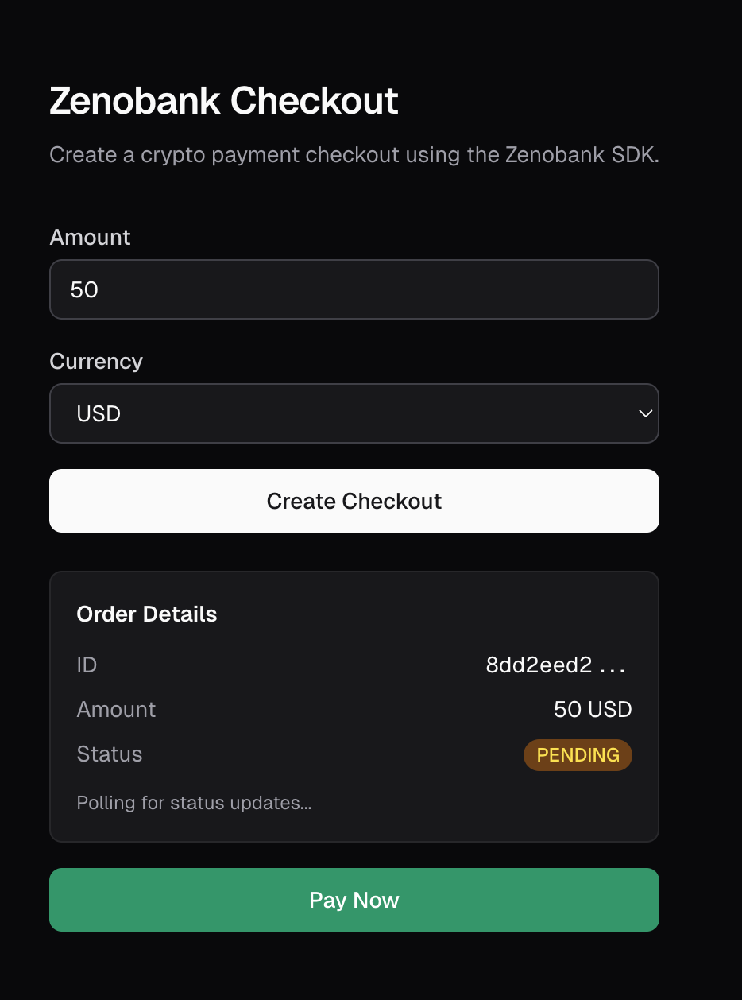

# Next.js Crypto Payment Gateway

Next.js example for accepting crypto payments with [Zeno Bank](https://zenobank.io) and the [`@zenobank/sdk`](https://www.npmjs.com/package/@zenobank/sdk). Uses the App Router, Route Handlers, and a client-side checkout form that polls for payment status.

<p align="center">
  
  
</p>

## How it works

1. The user enters an amount and currency on the home page (`src/app/page.tsx`)
2. `POST /api/orders` — creates an order and a Zeno Bank checkout
3. Returns a `checkoutUrl` — the user clicks "Pay Now" to open the Zeno Bank hosted page
4. The frontend polls `GET /api/orders/[id]` every 3s for status updates
5. Zeno Bank sends a webhook to `/api/webhooks/zenobank` — signature is verified with the SDK
6. Order status is updated in the in-memory store

> This example uses an in-memory `Map` as the database (`src/lib/database.ts`) to keep the example minimal. Swap it for a real database in production.

## Setup

### 1. Install dependencies

```bash
pnpm install
```

### 2. Configure environment variables

```bash
cp .env.example .env.local
```

Edit `.env.local` with your credentials:

```env
ZENOBANK_API_KEY=your-api-key           # From https://dashboard.zenobank.io/developer
ZENOBANK_WEBHOOK_SECRET=whsec_...       # From https://dashboard.zenobank.io/developer
```

> Get your API key and webhook secret from the [Zeno Bank Dashboard](https://dashboard.zenobank.io/developer).

### 3. Start the dev server

```bash
pnpm dev
```

Open [http://localhost:3000](http://localhost:3000) and create a checkout.

## API

### Create an order

```bash
curl -X POST http://localhost:3000/api/orders \
  -H "Content-Type: application/json" \
  -d '{"amount": "50", "currency": "USD"}'
```

Response:

```json
{
  "id": "8dd2eed2-7e1f-4a2b-9c3d-5f1a2b3c4d5e",
  "status": "PENDING",
  "amount": "50",
  "currency": "USD",
  "checkoutUrl": "https://pay.zenobank.io/ch_...",
  "paidAt": null,
  "createdAt": "2026-04-09T18:22:00.000Z"
}
```

Redirect the customer to `checkoutUrl` to complete the payment.

### Get an order

```bash
curl http://localhost:3000/api/orders/8dd2eed2-7e1f-4a2b-9c3d-5f1a2b3c4d5e
```

### Webhook

Zeno Bank sends a `POST` to `/api/webhooks/zenobank` when a checkout status changes. The handler verifies the signature with `zenobank.webhooks.verifyWebhook` before updating the order.

Handled events:
- `checkout.completed` — marks the order as `PAID`
- `checkout.expired` — marks the order as `CANCELLED`

To receive webhooks, go to the [Zeno Bank Dashboard](https://dashboard.zenobank.io/developer) and add your webhook URL. For local development, use [ngrok](https://ngrok.com) to expose your local server:

```bash
ngrok http 3000
```

Then add the ngrok URL as your webhook endpoint in the dashboard, e.g. `https://a1b2c3d4.ngrok-free.app/api/webhooks/zenobank`.

## Resources

- [Zeno Bank Documentation](https://docs.zenobank.io)
- [Zeno Bank Dashboard](https://dashboard.zenobank.io)
- [Checkout Demo](https://pay.zenobank.io/demo)
- [SDK on npm](https://www.npmjs.com/package/@zenobank/sdk)
